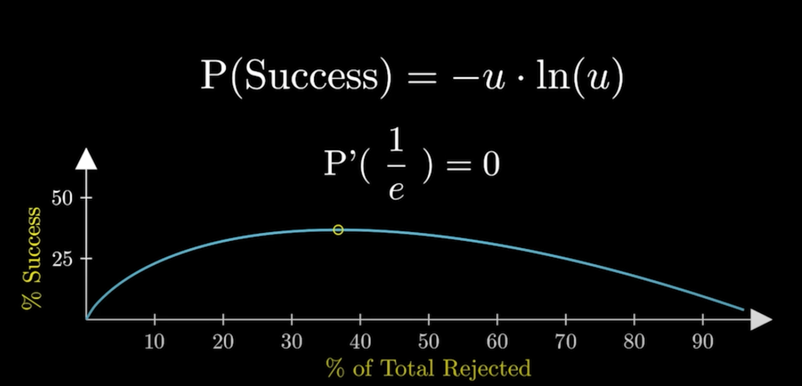

# Mathematically Optimising Dating

This mini project was inspired by a YouTube video by Viks on [How To Mathematically Optimise Dating](https://www.youtube.com/watch?v=GFvkcLF50VI).

This mini project aims to reproduce the following graph through Monte Carlo simulations:

